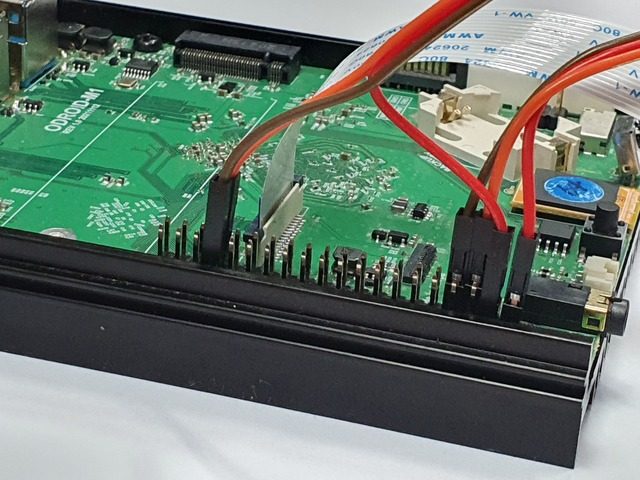

# yolo_tracking

it is ros2-foxy pkg on ODROID-M1.

### Purchase list
---------------------------------------
- [odroid-M1](https://www.hardkernel.com/shop/odroid-m1-with-4gbyte-ram)
- [ov5647](https://www.hardkernel.com/shop/m1-mipi-csi-camera-kit)
- pan/tilt braket x 1
- sg90 x 2

### requirements
---------------------------------------
- [ROS2 with NPU](https://wiki.odroid.com/getting_started/os_installation_guide#tab__odroid-m1)
- ros2 (foxy, preinstalled)
- opencv (preinstalled)
- librga-dev (preinstalled)
- odroid-wiringpi
- libwiringpi-dev

### circuit
---------------------------------------


```
[sg90 motor 1] # axis x
SIG --- phy #33
5V  --- phy #4
GRD --- phy #34

[sg90 motor 2] # axis y
SIG --- phy #7
5V  --- phy #2
GRD --- phy #9
```

### manual
---------------------------------------
[WARN] Camera screen flips and motor control direction must be adjusted personally!

- [Camera screen setting](doc/camera_screen_setting.rst)
- [Motor direction setting](doc/motor_direction_setting.rst)

1. Download & Build package.
```
$ git clone https://github.com/how2flow/ros2_yolo_tracking yolo_tracking
$ ln -s ~/ros2_yolo_tracking/motor_srv ~/robot_ws/src
$ ln -s ~/ros2_yolo_tracking ~/robot_ws/src/yolo_tracking
$ cb
```

2. execute nodes.

**terminal 1**
```
$ ros2 launch yolo_tracking image.launch.py
```

**terminal 2**
```
$ ros2 run yolo_tracking servo
```

**terminal 3**
```
$ ros2 run yolo_tracking control
```
